  

  
  
  
  
  

 

## Sobre mí

 

## Proyectos

  
  

  
  

 

## Stack

  

 

## Estadísticas

  
  

  

  

 

  <a href="mailto:juancambronerofresco@gmail.com">Escríbeme</a> · <a href="scripts/">Cómo está hecho esto</a>

