  

  
  
  
  
  

 

## Sobre mí

Hice mis prácticas en **Viewnext (Grupo IBM)**, en el área que trabaja con **IBM Maximo** — la plataforma con la que las grandes empresas gestionan sus activos y el trabajo de sus equipos de mantenimiento. Me enganchó cómo estaba pensada. Cuando acabaron las prácticas, se acabó el acceso.

No intenté clonar Maximo. Habría sido ridículo: es enorme, lleva años de trabajo de mucha gente detrás y hace cosas que yo todavía ni entiendo. Cogí una sola idea —cómo organiza el trabajo de un equipo— y construí algo enfocado solo en eso.

Eso es **TimeMaster**: Spring Boot 3 detrás, Angular 17 delante, PostgreSQL debajo. 119 commits, sin compañeros de equipo. Fue mi Proyecto Final de Ciclo y sacó un **10/10**.

Me titulé en Desarrollo de Aplicaciones Multiplataforma (DAM) en junio de 2026 y ahora curso Ingeniería Informática en la UNED. Al ser a distancia, tengo plena disponibilidad para trabajar a jornada completa.

Lo que se me da bien: coger un problema, entender el dominio que hay detrás y construirlo entero — modelo de datos, API y pantalla.

 

## TimeMaster

<table>
<tr>
<td valign="top" width="380">

</td>
<td valign="top">

Plataforma de gestión de tareas y personal para equipos de mantenimiento, inspirada en sistemas EAM empresariales como IBM Maximo.

**API** — Spring Boot 3, arquitectura en capas, DTOs, pool HikariCP

**Datos** — PostgreSQL a través de Spring Data JPA

**Acceso** — Control por roles (Manager / Operario) con Spring Security

**Flujo** — Estados validados en el servidor: `Pendiente → En curso → En revisión → Completada/Rechazada`

**UI** — Angular 17 standalone, Tailwind CSS, validación en tiempo real y gestión documental con protección UUID

</td>
</tr>
</table>

 

## Stack

  

  <b>Lo que uso primero:</b> Java 17 · Spring Boot · Spring Data JPA · Spring Security · Angular · TypeScript · PostgreSQL · APIs REST

 

## Estadísticas

  
  

  

  

 

---

  Madrid · <a href="mailto:juancambronerofresco@gmail.com">juancambronerofresco@gmail.com</a> · Respondo a todo.

  Todo lo animado de esta página son SVG generados con Python desde <a href="scripts/">scripts/</a> y commiteados al repo — sin servicios de terceros que se caigan o dejen imágenes rotas. GitHub elimina <code>&lt;script&gt;</code> de los README pero sí ejecuta animaciones SMIL dentro de un SVG, así que todo el movimiento vive dentro del propio archivo. Un GitHub Action los regenera cada día.

